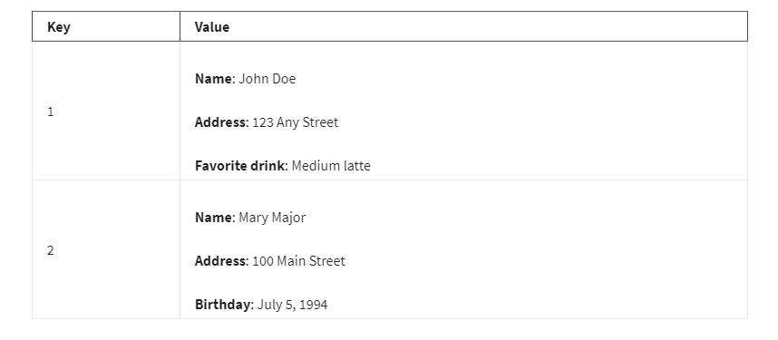

# <ins> Amazon DynamoDB </ins> #

- `Nonrelational Databases`

    - In a `nonrelational database`, you `create tables`

    - A `table is a place` where you can `store and query data.`

    - `Nonrelational databases` are `sometimes referred to as “NoSQL databases”` because they` use structures other than rows and columns to organize data`

    - One type of `structural approach` `for nonrelational databases` is `key-value pairs`

    - With `key-value pairs`, `data is organized into items` `(keys), and items have attributes (values)`

    - You can `think of attributes` as being `different features of your data.`

    - In a `key-value database`, you can `add or remove attributes from items` in the table` at any time.`

    - Additionally, not `every item in the table` `has to have` the `same attributes.`

    - 

# <ins> Amazon DynamoDB </ins> #

- `Amazon DynamoDB` is a `key-value database service.`

- It `delivers` `single-digit millisecond performance` at `any scale`

# <ins> Serverless </ins> #

- `DynamoDB` is `serverless`, which means that `you do not have` to 
    
    - `provision server`
    
    - `patch server` 
    
    - `manage servers`. 

- You also do not have to

    - `install software`

    - `maintain software`

    - `operate software`

# <ins> Automatic Scaling </ins> #

- `As the size of your database shrinks or grows`,` DynamoDB automatically scales to adjust` `for changes in capacity` `while maintaining consistent performance.`

- This `makes it a suitable choice for use cases` that `require high performance while scaling.`