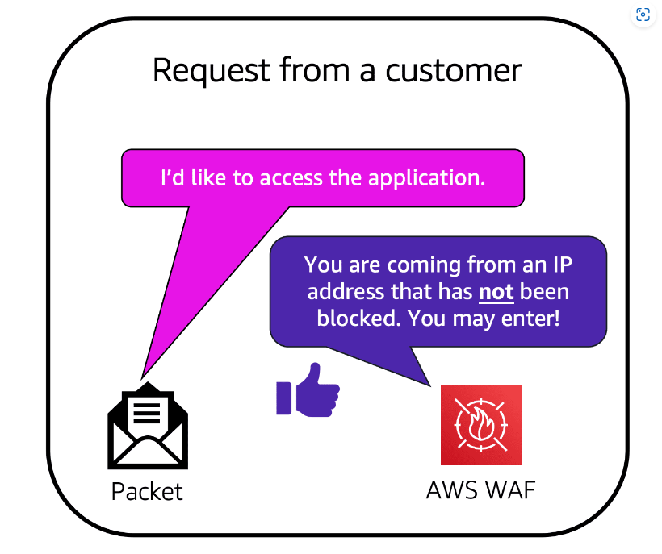
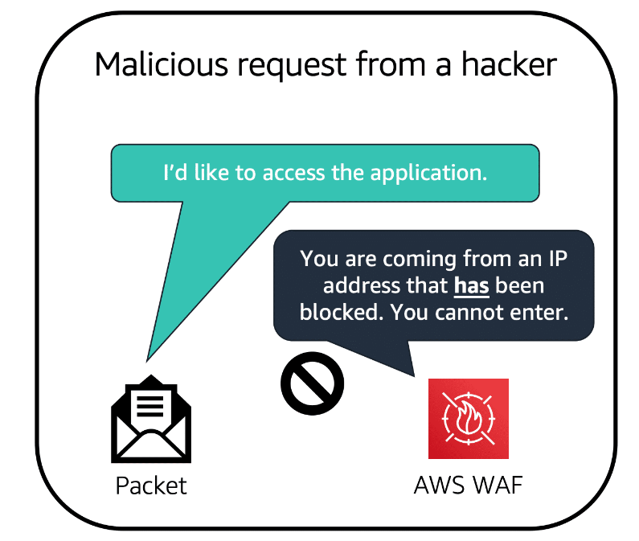

# <ins> Additional Security Services </ins> #

- `AWS Key Management Service (AWS KMS)`

    - The `coffee shop has many items`, such as `coffee machines`, `pastries`, `money in the cash registers`, and so on

    - You can `think of these items as data.`

    - The `coffee shop owners want to ensure` `that` `all of these items are secure`, whether `they’re sitting in the storage room or being transported between shop locations`. 

    - `In the same way`, `you must ensure that your applications’ data is secure while in storage (encryption at rest) and while it is transmitted, known as (encryption in transit)`.

    - `AWS Key Management Service (AWS KMS)` `enables` `you to perform "encryption operations through the use of cryptographic keys"`

    - A `cryptographic key` is a `random string of digits` ` used for` `locking (encrypting) and unlocking (decrypting) data`

    - `You can use AWS KMS to "create, manage, and use" cryptographic keys`

    - `You can also "control the use of keys" "across a wide range of services and in your applications" `

    - `With AWS KMS`, you can ` "choose the specific 'levels of access control ' that you need for your keys" `.

    - `For example, you can specify which IAM users and roles are able to manage keys`

    - `Alternatively, you can temporarily disable keys so that they are no longer in use by anyone.`

    - `Your keys never leave AWS KMS` .
    
    - `you are always in control of them.`

- AWS WAF or AWS Web Application Firewall :->

    - `AWS WAF is a web application firewall` that `lets you "monitor network requests"` that `"come into your web applications"`. 

    - `AWS WAF` `works` `together` `with` 
        
        - `Amazon CloudFront` 
        
        - And an `Application Load Balancer`.

    - Recall the `network access control lists on the subnet boundary` that `you learned about in an earlier module`.

    - `AWS WAF works in a similar way to block or allow traffic.`

    - However, `it does this` by using a `web access control list (ACL)` to `protect your AWS resources.`

    - `Here’s an example of how you can use AWS WAF to allow and block specific requests.`

    - 

    - `Suppose that your application has been receiving malicious network requests from several IP addresses`

    - `You want to prevent these requests from continuing to access your application`

    - `But you also want to ensure that legitimate users can still access it`

    - `You configure the "web ACL" to allow all requests except those from the IP addresses that you have specified.`

    - `When a request comes into AWS WAF , it checks against the list of rules that you have configured in the web ACL`

    - `If a request did not come from one of the blocked IP addresses, it allows access to the application. else blocked`

    - `However, if a request came from one of the blocked IP addresses that you have specified in the web ACL, it is denied access.`

    - 

- `Amazon Inspector`

    - Suppose that the `developers at the coffee shop are developing and testing a new ordering application`

    - `They want to make sure` that `they are designing the application` `in accordance with` `security best practices`

    - `However, they have several other applications to develop, so they cannot spend much time conducting manual assessments.`

    - `To perform automated security assessments, they decide to use Amazon Inspector.`

    - `Amazon Inspector` `helps` to `improve the "security and compliance of applications"` by `running automated security assessments`.

    - It `"checks applications"` for `security vulnerabilities` and `deviations from security best practices`, such as 
        
        - `open access to Amazon EC2 instances` 
        
        - `installations of vulnerable software versions`. 

    - `After Amazon Inspector has performed an assessment, it provides you with a list of security findings`

    - `The list prioritizes by severity level`, `including a detailed description of each security issue` and a `recommendation for how to fix it`

    - `However, AWS does not guarantee that following the provided recommendations resolves every potential security issue`

    - `Under the shared responsibility model, customers are responsible for`
        
        -  the security of their `applications, processes, and tools` that `run on AWS services`.

- Amazon GuardDuty

    - `Amazon GuardDuty` is a `service` that `provides "intelligent threat detection" for your "AWS infrastructure and resources".`

    -  It `identifies threats` by 
        
        - `continuously monitoring the network activity `
        
        - `account behavior within your AWS environment`.

    - `After you have enabled GuardDuty for your AWS account`

    - `GuardDuty begins monitoring your network and account activity.`

    - `You do not have to "deploy or manage any additional security software" `

    -  `GuardDuty` then `continuously analyzes data` 
        
        - `from multiple AWS sources, including VPC Flow Logs and DNS logs.`

    - `If GuardDuty detects any threats, you can review detailed findings about them from the AWS Management Console`

    - `Findings include recommended steps for remediation`

    - `You can also configure AWS Lambda functions to take remediation steps automatically in response to GuardDuty’s security findings`.

