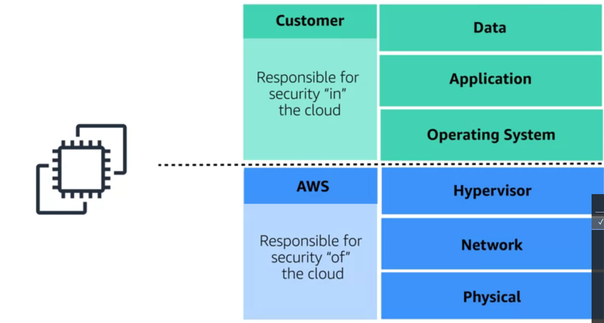

# <ins> Shared Responsibility Model </ins> #

- When it comes to `securing your business on AWS` it's important to ask the question 

    - who is `ultimately responsible for the security?` 
        
        - `a, you the customer `
        
        -  `b, AWS`

    - `The correct answer is yes, both`

    - `Both are ultimately responsible` for `making sure` that `you are secure`

- Now, if there's any `security expert` `watching this right` now, `you're probably shaking your head` saying `you can't have two different entities` `with the ultimate responsibility ` `over a single object.`

- That's `not security, that's wishful thinking`

- At AWS, we agree completely. 

    - But for us, `we don't look at your environment as a single object.`

    - Instead, we see it as a `collection of parts that build on each other`

    - ` AWS is responsible for the security of some of the objects, responsible 100 percent for those`

    - The others, `you are responsible 100 percent for their security. `

    - `This is what's known as the shared responsibility model`

-  It's `no different than securing a house.`

    - The `builder constructed the house with four walls and a door`. `It's their responsibility to make sure the walls are strong and the doors are solid`

    - It's `your responsibility, the homeowner, to close and lock the doors.`

-  It really is that simple on AWS as well. 

    - Take `EC2, for instance`

        - `EC2 lives in a physical building, a data center that must be secured.`

        - `It has a network and a hypervisor that supports your instances`

    - ` their individual operating systems`

    - `On top of that operating system`, `you have your application and that supports your data.`

    - `For EC2 and every service AWS offers, there's a similar stack of parts that build on top of each other.` as shown for the `EC2` in the `picture`

    - `AWS is 100 percent responsible for some`

    - `you are responsible for the others.`

-   `Starting with the physical layer.` 
    
    - This is 
        
        - `iron` 
        
        - `concrete` 
        
        - `fences` 
        
        - `security guard `

    - `Someone has to own the concrete`

    - `Someone has to staff the physical perimeter 24/7`

    - `This is AWS`

- coming back to the `AWS EC2 instance`

    - `On top of the physical layer, we have our network and our hypervisor.`

- Now I'm not going to go into details on how this is all secured but basically, `we have reinvented those technologies to make them faster, stronger, tamper-proof.`

- `But you don't have to just take our word for it`. We have `numerous third-party auditors who have gone through the code`, and `the way we build our infrastructure` and `can provide the right documentation you need for your security compliance structures.`

- coming back to the `AWS EC2 instance`

    - `Now on top of all that, on EC2, you now get to pick what operating system you want to run`

    - `This is the magic dividing line that separates our responsibility`

    - `AWS responsibility and your responsibility`

    - `This is your operating system. You're 100 percent in charge of this`

    - `AWS does not have any backdoor into your system here`

    - `You and you alone have the only encryption key to log onto the root of this OS or to create any user accounts there`

    - `Like No more than a construction company would keep copies of your front door key.`

    - `similarly AWS cannot enter your operating system.`

    - Here's a hint, `if someone from AWS calls and asks you for your OS key, it is not AWS.`

    - Now that means `your operations team is 100 percent responsible for keeping the operating system patched. and vulnerability`

    -  `If AWS discovers there are some new vulnerabilities in your version of Windows let's say, we can certainly notify your account owner, but we cannot deploy a patch for the vulnerability`

    - `This is a really good thing for your security`

    - This means `no one can deploy anything that might break your system without your team being the ones that do it.`

    - Now, `on top of that OS, you can run whatever applications you want. You own them, you maintain them.`

    - Which takes us the most `important part of the stack, your data`

    - `This is always your domain to control`

        - `Sometimes you might want to have your data open for everyone to see, like pictures on a retail website`

        - `Other times like banking or healthcare, yeah, not so much.`

        - `AWS provides everyone with the toolset they need`

            - `for their data to open it up`
                
                -  `to some authorized individuals`

                - `everyone` 

                - `just a single person under specific condition `

                - `even lock it down so that no one can access it `

                - `ability to have ubiquitous encryption i.e everywhere encryption `

                    - `That way, even if you accidentally left your front door open, all anyone would see is unreadable encrypted content`

- `The AWS, shared responsibility model is about making sure both sides understand exactly what tasks are ours.`

- `Basically, AWS is responsible for the security of the Cloud, and you are responsible for the security in the Cloud.`

- `Together, you have an environment you can trust.`

- 

            

