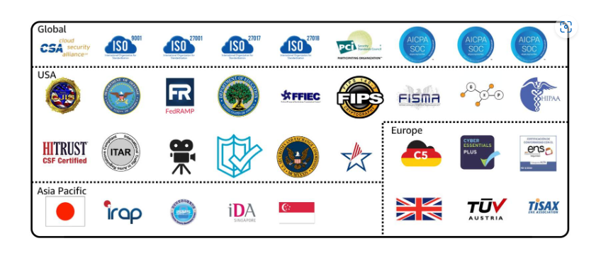

# <ins> Compliance </ins> #

- `AWS Artifact`

    - `Depending on your company’s industry, you may need to uphold specific standards`

    - An `audit or inspection `will `ensure that the company has met those standards.`

    - `AWS Artifact` is a `service` that `provides` `on-demand access to AWS security and compliance reports` and `select online agreements`

    - `Review, accept, and manage agreements with AWS.`

    - `AWS Artifact` consists of `two main sections`: `AWS Artifact Agreements and AWS Artifact Reports`.

        - `AWS Artifact Agreements` :---> 

            - Suppose that `your company needs to sign an agreement with AWS` regarding `your use of certain types of information/data throughout AWS services`.

            - `You can do this through AWS Artifact Agreements.` 

            - `In AWS Artifact Agreements , you can review and accept`

                - `manage agreements for an individual account`

                - `for all your accounts in AWS Organizations`

                - `Different types of agreements are offered to address the needs of customers who are subject to specific regulations`

                - `such as the Health Insurance Portability and Accountability Act (HIPAA).`

        - `AWS Artifact Reports` :--->

            - Next, `suppose that a member of your company’s development team is building an application` and `needs more information about their responsibility` for `complying with certain regulatory standards.`

            - `You can advise them to access this information in AWS Artifact Reports. `

            - `AWS Artifact Reports provide compliance reports from third-party auditors`

            - `These auditors have tested and verified that AWS is compliant with a variety of global, regional, and industry-specific security standards and regulations`

            - `AWS Artifact Reports remains up to date with the latest reports released.`

            - `You can provide the AWS audit artifacts to your auditors or regulators as evidence of AWS security controls.` 

        
        - The following are some of the `compliance reports and regulations` that you can find `within AWS Artifact` (in picture)

        - Each report includes a `description of its contents` and the `reporting period for which the document is valid.`

        - 