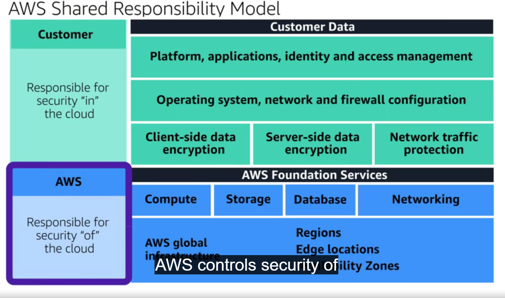

# <ins> Introduction </ins> #

-  I want to let you in on the `security measures` we have in place

- we have to describe the various `security mechanisms` we offer on the `AWS cloud` such as 

    -  `shared responsibility model` :-> 

        - With the `shared responsibility model` we have 
            
            - `AWS controls "security of the cloud" ` 
            
            - `customers controls "security in the cloud".`

        - We as `AWS`, `control` the 
            
            - `data centers`
            
            - `security of our services`
            
            - `all the layers in this section`

        - The next part are the `workloads that AWS customers run in the cloud` and `those are the customer's responsibility to secure`

        - `It's something` we `share with customers` `to ensure security in the cloud.`

        - Let's `take a look at` the 
            
            - `various other security services`, `mechanisms`, and `features` that `AWS has to offer in this module`

- 